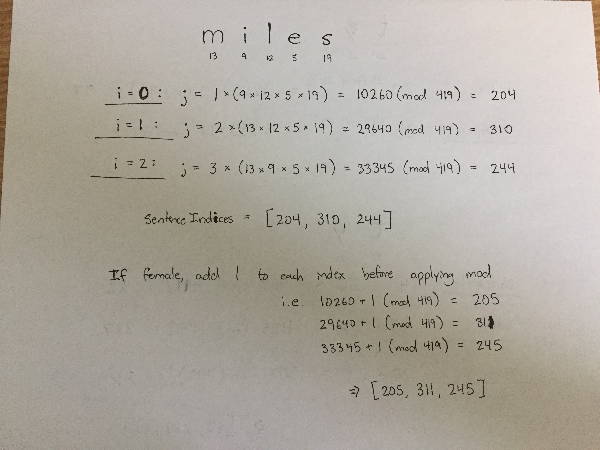
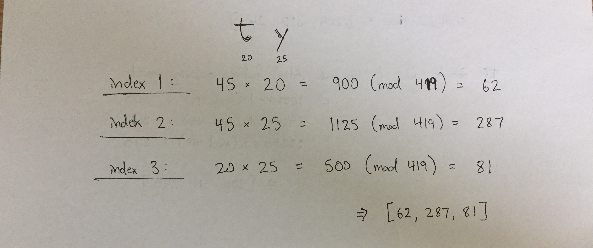

# First Name Analysis   

First Name Analysis is an Alexa skill that prompts the user for their first name and gender, then responds with a brief analysis of their name.

### Mapping Algorithm (names of length 3 or more)

Names and their genders are mapped to analyses by the following algorithm:
* There is a list of 419 possible name analysis sentences in an array
* Each letter in a name corresponds to its alphabetical index (a = 1, b = 2, ... z = 26).  This is calculated by the following expression: `parseInt(letter, 36) - 9`
* The algorithm starts at the first letter of the name, and proceeds through the third letter
* For each letter, a product is calculated by multiplying the number of the letter in the word (either 1, 2, or 3) by the product of the alphabetical indices of all __other__ letters in the word
* This product is guaranteed to be a relatively large number, so it is taken __modulo 419__ (the length of the list of possible name analysis sentences)
* This process is performed three times (for each of three first letters), which produces three sentence indices between 0 and 419
* The final analysis is then constructed by concatenating the three sentences in the sentences array which correspond to the computed indices

Here is an example of this mapping algorithm on the name "Miles":

### Alternative Algorithm

For cases in which the name has only two letters, the following basic procedure is used:
* The first two indices are calculated by multiplying the sum of the two alphabetic indices of the name's letters by the alphabetic index of the letter whose index in the name matches the index being computed.  The final index is computed by taking this index __modulo 419__
* The final index is simply the product of the alphabetical indices of the two letters in the name, also taken __modulo 419__.

The list of sentences that may be mapped to can be found in `/lambda/analysisSentences.js`.
